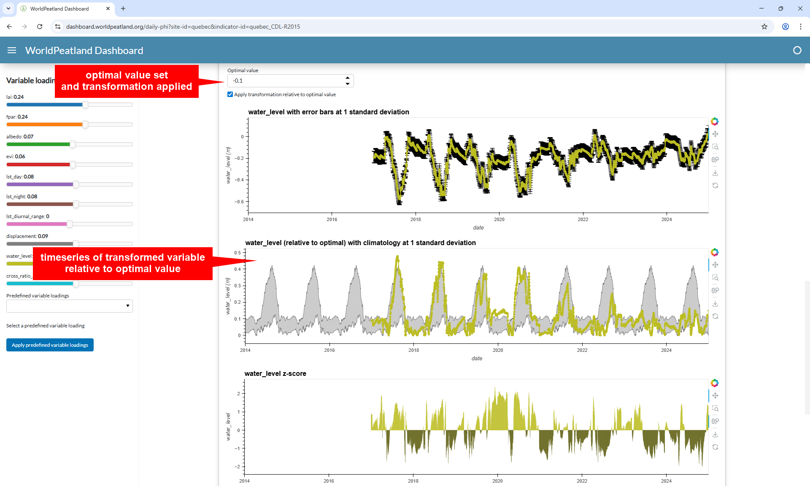

# WorldPeatland Dashboard User Guide

## Sitemap

The following is a flowchart showing the user journey through the pages of the dashboard

## Homepage

The homepage introduces the user to the WorldPeatland project and describes all of our sites of interest (test and pilot sites).

Each site is represented by a card (initially collapsed).

Clicking on a site expands the card to show more information about the site, including links to relevant publications and datasets.

The user can then choose to either explore the data products available for that site, or explore the peat health indicators within that site.

The information presented on this page is loaded directly from the WorldPeatland STAC data catalogue.

## Data products

Having selected a site of interest and then chosen to explore the peat mapping and monitoring data products, this page introduces each of the data products, detailing how each is produced and how it is relevant to the characterisation of peat.

Each data product is represented by a card (initially collapsed).

Clicking on a data product expands the card to show more information about the data product, including links to relevant publications and datasets.

The user is encouraged to select a data product to explore further.

The information presented on this page is loaded directly from the WorldPeatland STAC data catalogue.

## Explore data

Having chosen a site of interest and a data product, this page provides an interactive visualisation.

In the main section of the page we present a map and a timeseries plot. 
Both plots are dynamic, based on a spatio-temporal point of interest (POI).
The map is rendered at a given time, and the timeseries is plotted for a specified location.
Updating the time of the POI reloads the map, and updating the location of the POI reloads the timeseries plot.

In the sidebar we provide the following controls:

- latitude and longitude inputs to control the location of the POI
- a webmap in the familiar web-mercator projection, with a choice of basemaps to provide context
  - the POI is shown on the webmap
  - clicking on the webmap updates the latitude and longitude of the POI
  - the data extend is shown on the webmap
- a date slider to control the date of the POI
- controls to select the colourmap and value range for rendering the map
- a checkbox to toggle whether to overlay the WorldPeatland peat extent on the map

The main section of the page displays the map and a timeseries plot.
The map is rendered at the date of the POI, and the timeseries is plotted for the location of the POI.

The map is plotted in the native projection of the data product.
Clicking on the map updates the latitude and longitude of the POI, reloading the timeseries plot.

The timeseries plot also shows the uncertainty of the data product.
Clicking on the timeseries plot updates the date of the POI, reloading the map.

At the bottom of the page we provide links to download the map or timeseries data,
as defined by the POI.

Each of the plots has a number of interactive controls:

- pan and zoom
- download the plot as an image
- reset the view

The following shows the peat extent overlay.

## Areas of interest

Having selected a site of interest and then chosen to explore the peat health indicators,
this page introduces areas of interest (sub-regions within the site),
over which we have pre-generated the peatland monitoring output datasets.

Each area of interest is represented by a card (initially collapsed).

Clicking on an area of interest expands the card to show more information, including a map,
and links to the daily or annual peat health indicators.

## Daily peat health indicators

Having chosen a site of interest, an area of interest within that site, and the option to explore daily peat heath indicators,
this page provides an interactive visualisation of the pre-generated peatland monitoring output datasets.

The main section of the page begins with an explanation of the data processing steps,
and how the interactive visualisation works.
Below this we show the map of the peat extent for the area of interest.

Below the peat extent map we display the input data variables.
Each variable is represented by a colour-coded card (initially collapsed).

Clicking on a variable expands the card to show a number of plots for that variable.

1. A timeseries plot of the variable, with error bars.
2. A timeseries plot (optionally transformed relative to some optimal value), with climatolgy.
3. A timeseries plot of the standardised anomaly (z-score).

The following example demonstrates the effect of setting an optimal water level of -0.1 meters.

Before transformation is applied:

With transformation:

In the sidebar we provide one colour-coded slider per variable.
These sliders control the loading of each variable in the calculation of the peat health indicator.
The user can adjust the sliders to interactively explore the effect of different loadings on the peat health indicator.

Below the variable loading sliders we provide access to sets of pre-defined loadings.
These have been calculated statistically, or defined by experts.

At the bottom of the page we plot the integrated peat health indicator,
as calculated using the variable loadings (defined by the sliders),
and accounting for any variables that have been transformed relative to an optimal value.

## Annual peat health indicators

Having chosen a site of interest, an area of interest within that site, and the option to explore annual peat heath indicators,
this page provides an interactive visualisation of the pre-generated peatland monitoring output datasets.
The page is functionally similar to the daily peat health indicators.

