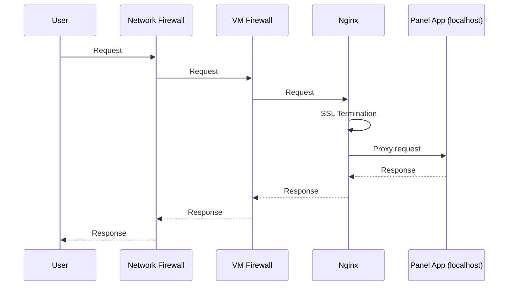

# Deployment

This document describes a basic deployment of the WorldPeatland dashboard on the CREODIAS platform.

This deployment uses a single host VM, with no load balancing or redundancy.



## Create a VM

Using the WAW/FRA cloud panel

- region: WAW3-2
- Source: Ubuntu 20.04 LTS
- Flavor: eo2a.large (2 vCPU, 8 GB RAM, 32 GB disk)
- Security Groups: add `allow_ping_ssh_icmp_rdp`
- Security Groups: attach a (new) security group for HTTP/S ingress

- associate a public floating IP to the new VM
- assign a DNS A-record to point to this IP address `dashboard.worldpeatland.org`

You should now be able to SSH into the VM as `eouser@dashboard.worldpeatland.org`,
using the ssh key provided during the VM creation.

## Update OS packages and install requirements

```bash
sudo apt update
sudo apt upgrade
sudo apt install nano
sudo apt install ufw
sudo apt install nginx
sudo apt install certbot python3-certbot-nginx
```

## Configure the firewall

```bash
sudo ufw allow ssh
sudo ufw allow 'Nginx HTTP'
sudo ufw allow 'Nginx HTTPS'
sudo ufw enable
sudo ufw status verbose
```

## Welcome to nginx!

You should now be able to access the Nginx default page at `http://dashboard.worldpeatland.org`.

## Clone this repository

to `/home/eouser/wpl-notebooks/`

Make a directory for the site-level peat health indicator data

```bash
mkdir /home/eouser/site-level-phi
```

Use environment variable `SITE_LEVEL_PHI_DIR` to point to this directory.

## Add nginx site configuration

Nginx is configured as a reverse proxy in front of the Panel application.
See [panel docs](https://panel.holoviz.org/how_to/server/proxy.html)
and [bokeh docs](https://docs.bokeh.org/en/latest/docs/user_guide/server/deploy.html#basic-reverse-proxy-setup).

```bash
sudo cp deployment/nginx.conf /etc/nginx/sites-available/dashboard.worldpeatland.org
sudo ln -s /etc/nginx/sites-available/dashboard.worldpeatland.org /etc/nginx/sites-enabled/
sudo nginx -t
sudo rm /etc/nginx/sites-enabled/default
sudo systemctl reload nginx
```

## Configure certbot

```bash
sudo certbot --agree-tos --nginx -d dashboard.worldpeatland.org
```

Follow the prompts, and when asked...

```
Please choose whether or not to redirect HTTP traffic to HTTPS, removing HTTP access.
- - - - - - - - - - - - - - - - - - - - - - - - - - - - - - - - - - - - - - - -
1: No redirect - Make no further changes to the webserver configuration.
2: Redirect - Make all requests redirect to secure HTTPS access. Choose this for
new sites, or if you're confident your site works on HTTPS. You can undo this
change by editing your web server's configuration.
```

choose option 2 to redirect HTTP traffic to HTTPS,
by allowing certbot to modify the Nginx configuration.

Check that certbot will run automatically to renew the certificate:

```bash
sudo systemctl status certbot.timer
```

## Install Anaconda

Follow [instructions](https://www.anaconda.com/docs/getting-started/anaconda/install#linux-installer)

## Install the python environment

```bash
conda env create -f environment.yml
```

## Serve the panel application

```bash
PYTHONPATH=$(pwd) conda run --live-stream -n wpl-notebooks panel serve app/*.ipynb --index sites --port 5006 --allow-websocket-origin=dashboard.worldpeatland.org
```

Check that the application is running by visiting `https://dashboard.worldpeatland.org`, then stop the server with `Ctrl-C`.

## Configure the panel application to run as a systemd service

Check the paths in the service file `deployment/wpl-dashboard.service` and adjust them if necessary.
Pay specific attention to the `SITE_LEVEL_PHI_DIR` environment variable,
which should be an absolute path to a directory where data for the site-level peat health indicators is stored.

```bash
sudo cp deployment/wpl-dashboard.service /etc/systemd/system/wpl-dashboard.service
sudo systemctl daemon-reload
sudo systemctl enable wpl-dashboard.service
sudo systemctl start wpl-dashboard.service
```

check the status of the service:

```bash
sudo systemctl status wpl-dashboard.service
```

check the logs of the service:

```bash
sudo journalctl -u wpl-dashboard.service -f
```

## Monitor the application

The url `https://dashboard.worldpeatland.org/liveness` is a health check endpoint. 
You can point tools like [uptimedoctor](www.uptimedoctor.com) at this URL to monitor the application.
